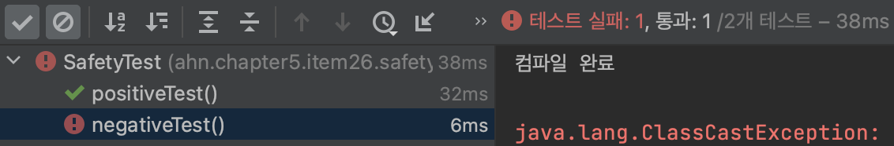

# Raw 타입은 사용하지 말라.

## 개요

#### 용어 정리

- 클래스와 인터페이스 선언에 타입 매개변수가 쓰이면, **제네릭 클래스** 혹은 **제네릭 인터페이스**라 한다.
- 제네릭 클래스와 제네릭 인터페이스를 **제네릭 타입**(generic type)이라 한다.
- 각각의 제네릭 타입은 일련의 **매개변수화 타입**(parameterized type)을 정의한다.
- raw 타입은 타입 선언에서 제네릭 타입 정보가 전부 지워진 것처럼 동작한다.

## 컬렉션과 제네릭

`List<String>`의 원소 타입은 `String`인 리스트를 뜻하는 매개변수화 타입이고, `String`이 정규 타입 매개변수 `E`에 해당하는 실제 타입 매개변수다.
제네릭 타입을 하나 정의하면 그에 딸린 **raw 타입도** 함께 정의된다.  

제네릭을 지원하기 전 컬렉션을 다음과 같이 선언했다. 

##### 컬렉션의 raw 타입 - 따라하지 말 것!
```java
// Stamp 인스턴스만 취급한다.
private final Collection stamps = ...;
```

자바 9에서도 동작하지만 실수로 `Stamp` 대신 `Coin`을 넣어도 오류 없이 컴파일되고 실행되기 때문에 좋은 예라고 볼 수 없다.

##### 테스트

```java
public class StampCoinTest {
    @Test
    void positiveTest() {
        // given
        final Collection stamps = new ArrayList();
        
        // when
        stamps.add(new Coin("coin"));
        stamps.add(new Stamp("stamp"));
    }

    @Test
    void negativeTest() {
        // given
        final Collection stamps = new ArrayList();
        stamps.add(new Coin("coin"));
        stamps.add(new Stamp("stamp"));

        // when
        for (Iterator i = stamps.iterator(); i.hasNext(); ) {
            Stamp stamp = (Stamp) i.next(); // ClassCastException 을 던진다.
            stamp.cancel();
        }
    }
}
```

##### 결과


재네릭을 활용하면 이 정보가 주석이 아닌 타입 선언을 통해 해결할 수 있다. 이 방식은 컴파일러에게 `Stamp` 인스턴스만 넣어야 함을 알려주기에 정상적인 동작을 보장할 
수 있다.

```java
private final Collection<Stamp> stamps = ...;
```

컴파일 오류가 발생하면 정확히 어느 코드에서 잘못 입력이 된건지 알 수 있다.

##### 테스트

```java
public class StampCoinTest {
    @Test
    void negativeCompileTest() {
        // given
        final Collection<Stamp> stamps = new ArrayList<>();
        
        // when
        stamps.add(new Stamp("stamp"));
        stamps.add(new Coin("coin"));
    }
}
```

##### 결과

```
error: incompatible types: StampCoinTest.Coin cannot be converted to StampCoinTest.Stamp
        stamps.add(new Coin("coin"));
```

Raw 타입을 쓰면 제네릭이 안겨주는 안전성과 표현력을 모두 잃게 된다. 현재 raw 타입이 존재하는 이유는 제네릭을 제공하기 전 코드와의 호환성을 위해서다.

### `List`와 `List<Object>`의 차이점

`List` 같은 raw 타입은 사용해서 안되지만, `List<Object>`는 괜찮다. `List<Object>`는 `List`와 다르게 모든 타입을 허용한다는 의미를 컴파일러에 
전달한다는 것이다. `List<String>`은 `List`의 하위 타입이지만 `List<Object>`의 하위 타입은 아니다. 그래서 `List`가 `List<Object>`보다 
안전하지 않다.

다음과 같이 `List`를 활용하면 컴파일은 성공하지만 런타임시 오류가 발생하는걸 확인할 수 있다.

##### 테스트

```java
public class SafetyTest {

    @Test
    void positiveTest() {
        System.out.println("컴파일 완료");
        
        // given
        List<String> strings = new ArrayList<>();
        
        // when
        unsafeAdd(strings, Integer.valueOf(42));
    }

    @Test
    void negativeTest() {
        System.out.println("컴파일 완료");
        
        // given
        List<String> strings = new ArrayList<>();
        
        // when
        unsafeAdd(strings, Integer.valueOf(42));
        String s = strings.get(0); // 컴파일러가 자동으로 형변환 코드를 넣어준다.
    }

    private void unsafeAdd(List list, Object o) {
        list.add(o);
    }
}
```

##### 결과




다음과 같이 `List<Object>`를 활용하면 컴파일시 오류를 찾을 수 있는걸 확인할 수 있다.

##### 테스트

```java
public class SafetyTest {

    @Test
    void compileNegativeTest() {
        System.out.println("컴파일 완료");
        
        // given
        List<String> strings = new ArrayList<>();
        
        // when
        safeAdd(strings, Integer.valueOf(42));
        String s = strings.get(0);
    }

    private void safeAdd(List<Object> list, Object o) {
        list.add(o);
    }
}
```

##### 결과

```
error: incompatible types: List<String> cannot be converted to List<Object>
        safeAdd(strings, Integer.valueOf(42));
```

## 비한정적 와일드카드 타입

다음 코드는 동작하지만 raw 타입을 사용했기에 안전하지 않다.

##### 잘못된 예 - 모르는 타입의 원소도 받는 raw 타입을 사용했다.

```java
static int numElementsInCommon(Set s1, Set s2) {
    int result = 0;
    for (Object o1 : s1)
        if (s2.contains(o1))
            result++;
    return result;
}
```

안전성 향상을 위해 비한정적 와일드카드 타입(unbounded wildcard type)을 대신 사용하는게 좋다. 제네릭 타입을 쓰고 싶지만 실제 타입 매개변수가 무엇인지 신경 
쓰고 싶지 않다면 비한정적 와일드카드 타입을 사용하자.

##### 비한정적 와일드카드 타입을 사용하라. - 타입 안전하며 유연하다.

```java
static int numElementsInCommon(Set<?> s1, Set<?> s2) { ... }
```

### `Set`과 `Set<?>`의 차이점

`Set`을 사용하면 타입 불변식을 훼손하기 쉽지만 `Set<?>`을 사용하면 null 외에는 어떤 원소도 넣을 수 없다.

##### 테스트

```java
public class WildCardTest {

    @Test
    void rawTypeTest() {
        // given
        Set set = new HashSet();
        
        // when
        set.add("verboten");
        set.add(42);
    }
}
```

##### 결과


##### 테스트

```java
public class WildCardTest {

    @Test
    void positiveUnboundedWildCardTest() {
        // given
        Set<?> set = new HashSet<>();

        // when
        set.add(null);
    }

    @Test
    void negativeUnboundedWildCardTest() {
        // given
        Set<?> set = new HashSet<>();

        // when
        set.add("verboten");
    }
}
```

##### 결과


```
error: incompatible types: String cannot be converted to CAP#1
        set.add("verboten");
                ^
  where CAP#1 is a fresh type-variable:
    CAP#1 extends Object from capture of ?
```

어떤 원소를 넣지도 못하고 꺼낼 수 있는 객체의 타입도 전혀 알 수 없는 제약을 받아들일 수 없다면 제네릭 메서드나 한정적 와일드카드 타입을 사용하면 된다.

## Raw 타입을 사용할 수 있는 예외

- 자바 명세는 class 리터럴에 매개변수화 타입을 사용하지 못하게 했다.
  - 자바 명세는 class 리터럴에 매개변수화 타입을 사용하지 못하게 했다.
  - 예시
    - 가능: `List.class`, `String[].class`, `int.class`
    - 불가능: `List<String>.class`, `List<?>.class`
- 런타임에 제네릭 타입 정보가 지워지므로 instanceof 연산자는 비한정적 와일드카드 타입 이외의 매개변수화 타입에는 적용할 수 없다.

##### Raw 타입을 써도 좋은 예 - instanceof 연산자

```java
if (o instanceof Set) { // raw 타입
    Set<?> s = (Set<?>) o; // 와일드카드 타입
}
```

## 정리

Raw 타입은 런타임에 예외를 발생시킬 수 있으니 사용하면 안 된다. Raw 타입은 제네릭을 제공되기 전에 사용했고 현재는 호환성을 위해 제공된다. `Set<Object>`는 
어떤 타입의 객체도 저장할 수 있는 배개변수화 타입이고, `Set<?>`은 모종의 타입 객체만 저장할 수 있는 와일드카드 타입이다. `Set`은 제네릭 타입 시스템에 속하지
않는다. `Set<Object>`와 `Set<?>`은 안전하지만 `Set`은 안전하지 않다.

| 한글 용어         | 영문 용어                   | 예                                     |
|---------------|-------------------------|---------------------------------------|
| 매개변수화 타입      | parameterized type      | `List<String>`                        |
| 실제 타입 매개변수    | actual type parameter   | `String`                              |
| 제네릭 타입        | generic type            | `List<E>`                             |
| 정규 타입 매개변수    | formal type parameter   | `E`                                   |
| 비한정적 와일드카드 타입 | unbounded wildcard type | `List<?>`                             |
| 로 타입          | raw type                | `List`                                |
| 한정적 타입 매개변수   | bounded type parameter  | `<E extends Number>`                  |
| 재귀적 타입 한정     | recursive type bound    | `T extends Comparable<T>>`            |
| 한정적 와일드카드 타입  | bounded wildcard type   | `List<? extends Number>`              |
| 제네릭 메서드       | generic method          | `static <E> List<E>`, `asList(E[] a)` |
| 타입 토큰         | type token              | `String.class`                        |