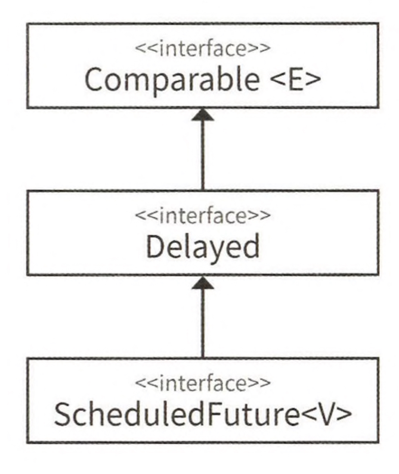

# 한정적 와일드카드를 사용해 API 유연성을 높이라

매개변수화 타입은 불공변(invariant)입니다.

`List<String>`은 `List<Object>`의 하위 타입이 아니지만 `List<Object>`에는 어떤 객체든 넣을 수 있지만, `List<String>`에는 문자열만 넣을 수 
있습니다. 즉, `List<String>`은 `List<Object>`가 하는 일을 제대로 수행하지 못하니 하위 타입이 될 수 없고, 리스코프 치환 원칙에 어긋납니다.

하지만 때론 불공변 방식보다 유연성을 가져야 할 때가 있습니다.

## 불공변 방식보다 유연성을 가지고 있는 한정적 와일드카드

##### Stack 클래스의 public API

```java
public class Stack<E> {
	public Stack();
	public void push(E e);
	public E pop();
	public boolean isEmpty();
}
```

### 하위 타입을 허용해야 되는 케이스

##### 와일드카드 타입을 사용하지 않은 pushAll 메서드 - 결함이 있다!

```java
public void pushAll(Interable<E> src) {
	for (E e : src)
		push(e);
}
```

`Stack<Number>`로 선언하고 `Integer`을 `pushAll()`하려고 하면, `Integer`가 `Number`의 하위 타입임에도 불구하고 오류가 발생합니다. 이는 매개 
변수화 타입이 불공변이기 때문입니다.

```java
public class StackTest {

	@Test
	void pushAllTest() {
		// given
		Stack<Number> stack = new Stack<>();
		Iterable<Integer> integers = List.of(1, 2, 3);

		// when
		stack.push(integers);
	}
}
```

```
error: incompatible types: Iterable<Integer> cannot be converted to Iterable<Number>
        stack.pushAll(integers);
                      ^
```

위 코드의 오류는 한정적 와일드카드 타입을 활용하여 해결할 수 있습니다. 구체적으로 pushAll의 입력 매개변수 타입은 `E의 Iterable`이 아니라 
`E의 하위 타입의 Iterable`이여야 됩니다. 즉, 와일드카드 타입을 활용하여 `Iterable<? extends E>`로 선언해야 됩니다.

##### E 생산자(producer) 매개변수에 와일드카드 타입 적용

```java
public void pushAll(Iterable<? extends E> src) {
	for (E e : src)
		push(e);
}
```

### 상위 타입을 허용해야 되는 케이스

##### 와일드카드 타입을 사용하지 않은 popAll 메서드 - 결함이 있다!

```java
public void popAll(Collection<E> dst) {
	while (!isEmpty())
		dst.add(pop());
}
```

컬렉션의 원소 타입이 스택의 원소 타입과 일치 하다면 괜찮지만, 그렇지 않으면 문제가 발생합니다.

```java
public class StackTest {
  
    @Test  
    void popAllTest() {  
        // given  
        Stack<Number> stack = new Stack<>();  
        Collection<Object> objects = List.of(1, 2, 3);  
  
        // when  
        stack.popAll(objects);
    }  
}
```

```
error: incompatible types: Collection<Object> cannot be converted to Collection<Number>
        stack.popAll(objects);
                     ^
```

`Collection<Object>`는 `Collection<Number>`의 하위 타입이 아니기 때문에, `pushAll`을 사용했을 때와 비슷한 오류가 발생합니다. 구체적으로 
`popAll`의 입력 매개변수의 타입은 `E의 Collection`이 아닌 `E의 상위 타입의 Collection`이여야 됩니다. 즉, 와일드카드 타입을 활용하여 `Collection<? super E>`로 선언해야 됩니다.

##### E 소비자(consumer) 매개변수에 와일드카드 타입 적용

```java
public void popAll(Collection<? super E> dst) {
	while (!isEmpty())
		dst.add(pop());
}
```

### 주의 사항

원소의 생산자나 소비자용 입력 매개변수에 와일드카드 타입을 사용하면 유연성을 극대화 할 수 있습니다. 하지만 입력 매개변수가 생산자와 소비자 역할을 동시에 한다면 
와일드카드 타입을 사용하지 말아야 됩니다.

### 공식

**PECS(펙스)**: producer-extends, consumer-super

Get and Put Principle(겟풋 원칙)이라고 부르기도 한다.

#### 생산자와 소비자

PECS 공식에서 생산자와 소비자는 `Collection` 입장에서 고려를 해야됩니다.

`Stack` 클래스에 `pushAll()`은 `Collection`에 어떤것도 추가하지 않고 있고, 즉 읽기만 하고 있기 때문에 생산자입니다.

반면 `popAll()`은 `Collection`에 원소들을 추가하고 있고, 즉 쓰기를 하고 있기 때문에 소비자입니다.

`Collection`이 생산자이자 소비자를 하는 메서드가 있을 수 있습니다. 이럴때는 `extend`나 `super`로 하지 않아야 됩니다. 하지만 이러한 메서드는 
CQS(Command-Query Separation) 원칙을 어기기 때문에 지양해야 됩니다.


## 와일드카드 타입으로 수정이 필요한 케이스

### Chooser

```java
public class Chooser<T> {

	private final List<T> choiceList;

	public Chooser(Collection<T> choices) {
		choiceList = new ArrayList<>(choices);
	}

	// ...
}
```

`Chooser<Number>`의 생성자에 `List<Integer>`를 넘기면 오류로 인해 컴파일이 되지 않습니다.

```java
public class ChooserTest {

	@Test
	void test() {
		// given  
		List<Integer> list = List.of(1, 2, 3);  
  
		// when  
		Chooser<Number> chooser = new Chooser<>(list);
	}
}
```

```
error: incompatible types: cannot infer type arguments for Chooser<>
        Chooser<Number> chooser = new Chooser<>(list);
                                             ^
    reason: inference variable T has incompatible equality constraints Number,Integer
  where T is a type-variable:
    T extends Object declared in class Chooser
```

T를 확장하는 와일드카드 타입을 사용하면 해결할 수 있습니다.

```java
public Chooser(Collection<? extends T> choices)
```

### Union

```java
public class Union {

	public static <E> Set<E> union(Set<E> s1, Set<E> s2) {
		Set<E> result = new HashSet<>(s1);  
		result.addAll(s2);  
		return result;
	}
}
```

`Set<Integer>`인 s1과 `Set<Double>`인 s2를 `union`에 넘기면 오류로 인해 컴파일 되지 않습니다.

```java
public class UnionTest {

	@Test
	void test() {
		// given  
		Set<Integer> integer = Set.of(1, 2);  
		Set<Double> doubles = Set.of(3.0, 4.0, 5.0);  
  
		// when  
		Set<Number> numbers = Union.union(integer, doubles);
	}
}
```

```
error: method union in class Union cannot be applied to given types;
        Set<Number> unionSet = Union.union(integers, doubles);
                                    ^
  required: Set<E>,Set<E>
  found: Set<Integer>,Set<Double>
  reason: inference variable E has incompatible equality constraints Double,Integer
  where E is a type-variable:
    E extends Object declared in method <E>union(Set<E>,Set<E>)
```

T를 확장하는 와일드카드 타입을 사용하면 해결할 수 있습니다. 그리고 반환 타입에 한정적 와일드카드 타입을 사용하면 유연성을 높여주지 않고 클라이언트 코드에서도 
와일드카드 타입을 써야 됩니다. 그러므로 반환 타입은 `Set<E>`인 불공변이어야 됩니다.

```java
public static <E> Set<E> union(Set<? extends E> s1, Set<? extends E> s2)
```

하지만 자바7까지는 타입 추론을 못하기 때문에 명시적 타입 인수를 사용해야 됩니다.

```java
Set<Number> numbers = Union.<Number>union(integer, doubles);
```

### 매개변수(parameter)와 인수(argument)의 차이

매개변수는 메서드 선언에 정의한 변수이고, 인수는 메서드 호출시 넘기는 '실제값'입니다.

```java
void add(int value) { ... }
add(10);
```

매개변수는 value이고 인수는 10입니다.

```java
class Set<T> { ... }
Set<Integer> = ...;
```

T는 타입 매개변수이고 Integer는 타입 인수입니다.


## Max

```java
public class Max {

	public static <E extends Comparable<E>> E max(List<E> List)
}
```

입력 매개변수는 E 인스턴스를 생산하기에  `List<E>`를 `List<? extends E>`로 수정해야 됩니다. 그리고 E 인스턴스를 소비하는 `Comparable<E>`는 
`Comparable<? super E>`로 수정해야 됩니다.

```java
public static <E extends Comparable<? super E>> E max(List<? extends E> List)
```

수정을 통해 `max()`를 더욱 유연하게 활용할 수 있게 되었습니다. 즉, 와일드카드 덕에 `Comparable`을 직접 구현하지 않고, 직접 구현한 다른 타입을 확장한 타입을 
지원할 수 있게 되었습니다.



>`ScheudledFuture`는 `Comparable<ScheduledFuture>`를 구현하지 않았습니다. 하지만 `ScheduledFuture`의 하위 인터페이스인 `Delayed`는 
> `Comparable<Delayed>`를 확장 하였고 `Comparable<? super E>` 덕에 `Delayed` 와 `ScheduledFuture`를 비교할 수 있게 되었습니다. 그래서 
> 아래의 코드가 처리할 수 있습니다.

```java
List<ScheduledFuture<?>> scehduledFutures = ...;
```

## 타입 매개변수와 와일드카드

타입 매개변수와 와일드카드에는 공통된 부분이 있어서, 메서드를 정의할 때 둘 중 어느 것을 사용해도 괜찮을 때가 많습니다. 만약 public API를 구현하는 거면 비한정적 
와일드 카드를 활용하는게 좋습니다.

##### swap 메서드의 두 가지 선언

```java
public static <E> void swap(List<E> list, int i, int j); // 비한정적 타입 매개변수
public static void swap(List<?> list, int i, int j); // 비한정적 와일드카드
```

메서드 선언에 타입 매개변수가 한 번만 나오면 와일드 카드로 대체하는게 좋습니다.

이때 비한정적 타입 매개변수`List<E>`라면 비한정적 와일드카드`List<?>`로 바꾸고, 한정적 타입 매개변수`List<E extends Number>`라면 한정적 와일드카드
`List<? extends Number>`로 바꾸면 됩니다.

하지만 비한정적 와일드 카드를 사용해서 다음과 같이 코드를 구현하면 컴파일 되지 않습니다.

```java
public static void swap(List<?> list, int i, int j) {
	list.set(i, list.set(j, list.get(i)));
}
```

```java
public class SwapTest {

	@Test
	void test() {
		// given  
		List<Integer> list = new ArrayList<>(List.of(1, 2, 3));  
		list.forEach(e -> System.out.print(e + " "));  
		System.out.println();  
		  
		// when  
		Swap.swap(list, 0, 2);  
		  
		// then 
		list.forEach(e -> System.out.print(e + " "));  
	}
}
```

```
java: incompatible types: java.lang.Object cannot be converted to capture#1 of ?
```

오류가 나는 원인은 리스트 타입이 `List<?>`인데, `List<?>`에는 `null` 값만 허용되기 때문입니다.

이를 해결하기 위해 실제 타입을 알려주는 private 도우미 메서드를 따로 작성하면 됩니다.

```java
public static void swap(List<?> list, int i, int j) {
	swapHelper(list, i, j)
}

private static <E> void swapHelper(List<E> list, int i, int j) {
	list.set(i, list.set(j, list.get(i)));
}
```

```java
public class SwapTest {

	@Test
	void test() {
		// given  
		List<Integer> list = new ArrayList<>(List.of(1, 2, 3));  
		list.forEach(e -> System.out.print(e + " "));  
		System.out.println();  
		  
		// when  
		Swap.swap(list, 0, 2);  
		  
		// then 
		list.forEach(e -> System.out.print(e + " "));  
	}
}
```

```
1 2 3 
3 2 1 
```

## 정리

PECS 공식은 생산자(producer)는 extends를 소비자(consumer)는 super를 사용해야 된다는 공식입니다. `Comparable`과 `Comparator`는 모두 
소비자입니다. 그리고 와일드카드 타입을 활용하면 API가 더욱 유연해지기 때문에 널리 쓰일 라이브러리에는 PECS 공식을 적용한 와일드카드 타입을 적용하는게 좋습니다.

### 참고

- [https://www.baeldung.com/java-generics-pecs](https://www.baeldung.com/java-generics-pecs)
